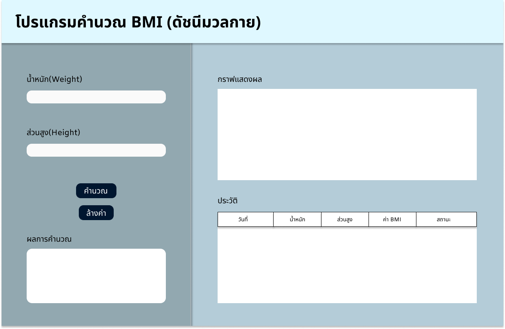

# 🏋️‍♂️ BMI Calculate
**เว็บแอปพลิเคชันคำนวณค่าดัชนีมวลกาย พร้อมกราฟแสดงแนวโน้มสุขภาพ (PWA)**



---
## ✨ คุณสมบัติของระบบ
* **Smart Calculation:** คำนวณ BMI และแปลผลเกณฑ์สุขภาพ (ผอม/ปกติ/อ้วน) ได้ทันที
* **Interactive Graph:** แสดงกราฟแนวโน้มสุขภาพด้วย **Chart.js**
* **Data Persistence:** บันทึกประวัติด้วย **LocalStorage** (ข้อมูลไม่หายแม้ปิดเว็บ)
* **PWA Ready:** รองรับการติดตั้งลงมือถือ และทำงานได้แม้ออฟไลน์

---
## 🛠️ 1. วิธีการติดตั้ง (Installation)

เนื่องจากเป็น Web Application แบบ Client-side จึงไม่ต้องติดตั้งโปรแกรมเสริมใดๆ
1.  **ดาวน์โหลด Source Code:**
    * Clone ผ่าน Git:
      ```bash
      git clone [https://mangeaw.github.io/BMI-Calculator/](https://mangeaw.github.io/BMI-Calculator/)[mangeaw]/[BMI Calculate].git
      ```
2.  **เข้าสู่โฟลเดอร์งาน:**
    * `cd bmi-tracker`

---
## ▶️ 2. วิธีรันโปรแกรม (How to Run)

สามารถเปิดใช้งานได้ 2 วิธี:
* **วิธีที่ 1 (แนะนำ):** ดับเบิ้ลคลิกไฟล์ **`index.html`** เพื่อเปิดผ่าน Web Browser (Chrome, Edge, Safari) ได้ทันที
* **วิธีที่ 2 (บนมือถือ):** เปิดลิงก์ GitHub Pages บนมือถือ -> กดเมนูตัวเลือก -> **"Add to Home Screen"** เพื่อติดตั้งเป็นแอป

---
## 📂 3. โครงสร้างโค้ด (Code Structure)

ไฟล์ในโปรเจกต์ถูกจัดระเบียบเพื่อให้เข้าใจง่าย ดังนี้:
* **`index.html`**
    * ไฟล์หัวใจหลัก (All-in-One)
    * ประกอบด้วยหน้าจอ (HTML), การตกแต่ง (CSS), และตรรกะการคำนวณ (JS)
* **`manifest.json`**
    * ไฟล์ระบุตัวตนของแอป (Web App Manifest)
    * กำหนดชื่อแอป, ไอคอน, และสีธีม สำหรับการติดตั้งบนมือถือ
* **`service-worker.js`**
    * ไฟล์ระบบหลังบ้าน (Service Worker)
    * จัดการ Cache เพื่อให้แอปโหลดเร็วและทำงานแบบ Offline ได้

---
## 🌐 ทดลองใช้งานออนไลน์ (Live Demo)
สามารถเข้าใช้งานได้ที่: https://mangeaw.github.io/BMI-Calculator/